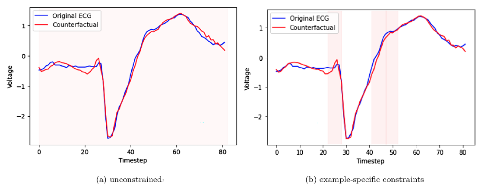

# Glacier: Guided Locally Constrained Counterfactual Explanations for Time Series Classification
Glacier: Guided Locally Constrained Counterfactual Explanations for Time Series Classification<br/>
Published at Machine Learning (MACH) Journal, 2024 Mar.<br/>
(Originally published at the DS'2021 Conference)<br/>
[[paper_link]](https://doi.org/10.1007/s10994-023-06502-x)

We propose `Glacier`, a model-agnostic method for generating *locally constrained counterfactual explanations* for time series classification using gradient search either on the original space, or on a latent space that is learned using an auto-encoder. An additional flexibility of our method is the inclusion of constraints on the counterfactual generation process that favour applying changes to particular time series points or segments, while discouraging changing some others. The main purpose of these constraints is to ensure the generation of more realistic and feasible counterfactuals. We conduct extensive experiments on a total of 40 datasets from the UCR archive, comparing different instantiations of Glacier against three competitors.

If you find this GitHub repo useful in your research work, please consider citing our paper:
```
@article{wang_glacier_2024,
	title = {Glacier: guided locally constrained counterfactual explanations for time series classification},
	volume = {113},
	issn = {1573-0565},
	doi = {10.1007/s10994-023-06502-x},
	number = {3},
	journal = {Machine Learning},
	author = {Wang, Zhendong and Samsten, Isak and Miliou, Ioanna and Mochaourab, Rami and Papapetrou, Panagiotis},
	month = mar,
	year = {2024},
}
```
Please also consider citing the original publication:
```
@inproceedings{wang_learning_2021,
	title = {Learning Time Series Counterfactuals via Latent Space Representations},
	booktitle = {International Conference on Discovery Science},
	author = {Wang, Zhendong and Samsten, Isak, and Mochaourab, Rami, and Papapetrou, Panagiotis},
	year = {2021},
}
``` 

## Dependencies
For reproducibility, all the experiments and the computational runtime are evaluated with NVIDIA GeForce RTX 2080 (GPU) and AMD Ryzen Threadripper 2950X 16-Core Processor (CPU), with following dependencies:
  - python=3.8
  - cudatoolkit=11.2
  - cudnn=8.1

### Installation:
We recommend to create a conda virtual environment with the following command:
```
conda env create -f environment.yml
```

## Data preparation

We mainly focus on the problem of binary classification tasks with univariate time series data. After filtering, a subset of 40 datasets from the [UCR archive](https://www.cs.ucr.edu/∼eamonn/time_series_data_2018/) is selected, containing various representations from different data sources. For example, *TwoLeadECG* represents ECG measurements in the medical domain and *Wafer* exemplifies sensor data in semiconductor  manufacturing. In terms of time series length, it varies from `24` (*ItalyPowerDemand*) to `2709` timesteps(*HandOutlines*) in our chosen subset.

For the evaluation in our experiment, we choose to apply 5-fold cross-validation with stratified splits, with a standard 80/20 training and testing for all the datasets. Also, to compensate the imbalanced target classes in specific datasets, we apply a simple upsampling technique and then choose to generate counterfactual explanations for a subset of 50 samples with a fixed random seed among the testing data. 

## Experiment Setup

In the experiment, we choose to train one of the most recent state-of-the-art CNN models, `LSTM-FCN`, as the black-box model to apply the Glacier counterfactual framework. We then employ two autoencoders to transform the original samples into counterfactuals: a 1-dimensional convolutional neural network (`1dCNN`) model and an `LSTM` model; together with a version of gradient search directly on the original space (`NoAE`).

Thus, we explore four variants of Glacier: *unconstrained*, *example-specific*, *global*, and *uniform* across 40 UCR datasets. In our main experiment, we set the decision boundary threshold $\tau=0.5$, and the prediction margin weight $w=0.5$ in the optimization function. The variants are explained as below:
- *unconstrained*: encouraging changes in the whole time series;
- *example-specific*: imposing constraints to favouring changes to particular time series points on a given test example, using LIMESegment (Sivill et al., 2022); 
- *global*: imposing constraints to favouring changes to particular time series points across all the test examples, using interval importance;  
- *uniform*: disencouraging changes in the whole time series. 


### Baseline Models
We additionally compare with three baseline models for the counterfactual generation:
- (Karlsson et al., 2018) *Random shapelet forest (RSF)*: we set the number of estimators to `50` and max depth to `5`, while the other parameters are kept at the default values (see the original implementation: `https://github.com/isaksamsten/wildboar`);
- (Karlsson et al., 2018) *k-NN counterfactual (k-NN)*: we train a k-NN classifier with k equals to `5` and the distance metric set to Euclidean;
- (Delaney et al, 2021) *Native Guide (NG)*: we adopt an implementation and default parameters from `https://github.com/e-delaney/Instance-Based_CFE_TSC`. 


## Running the comparison

The implementation code of our experiment is at [here](./src/gc_latentcf_search.py), with a detailed description of Glacier model parameters. For executing the experiment for a single dataset (e.g. *TwoLeadECG*), simply run:
```
python src/gc_latentcf_search.py --dataset TwoLeadECG --pos 1 --neg 2 --output twoleadecg-outfile.csv --w-type local --lr-list 0.0001 0.0001 0.0001;
```

Then for running the experiment for all the 40 datasets from UCR, run the following code:
```
bash run_all_datasets.sh
```

```
bash run_cf_baselines.sh
```

Finally, we conduct an ablation study to examine the effects of the following two hyperparameters in Glacier for the *TwoLeadECG* dataset: prediction margin weight parameter $w$ and decision boundary threshold $\tau$, using the following code:
```
bash run_ablation_pred_margin.sh
```

```
bash run_ablation_tau.sh
```


## Results

The results of main analysis are available at this [csv file](./results/results_final_all.csv), together with two ablation study [csv files](./results/). 

Besides, we have two example cases generated from Glacier. The first one shows examples of counterfactuals for ECG measurements using *unconstrained* and *example-specific* constraints in Glacier:

 

And the second case show the counterfactuals for engine signals with *unconstrained* and *global constraints* in Glacier:

 

In both cases, illustrated in blue are the original time series and in red the generated counterfactuals of the opposite class. The “red” bars suggest the time series points for which changes are favourable. 